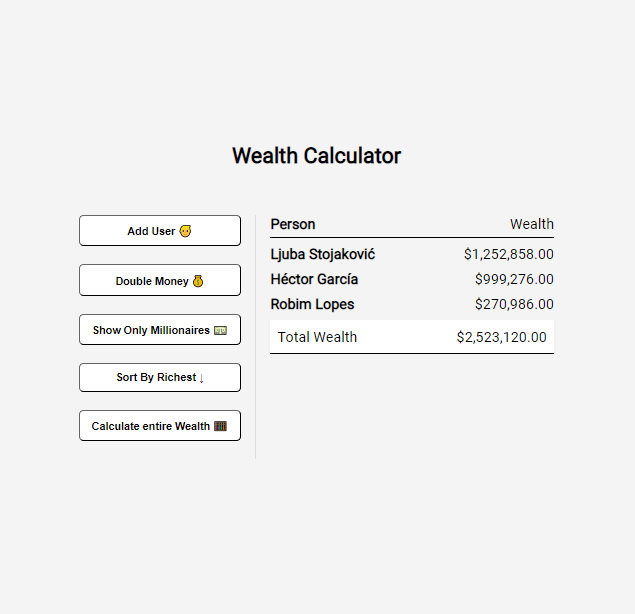

## Wealth Calculator

An app I created to practice high order array methods and DOM manipulation that admittedly has zero practical application.

## Project Specifications
- Fetch random users from the [randomuser.me](https://randomuser.me) API
- Use forEach() to loop and output user/wealth
- Use map() to double wealth
- Use filter() to filter only millionaires
- Use sort() to sort by wealth
- Use reduce() to add all wealth

